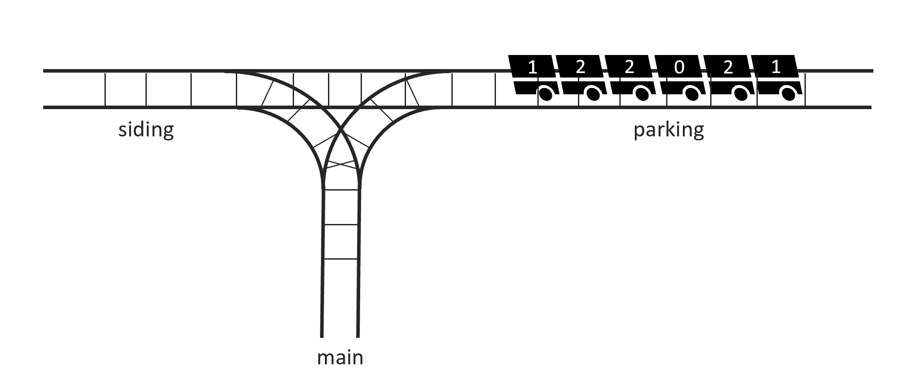

You are working at a tiny train station in the middle of nowhere. The station consists of only 3 railways: The main-, the parking- and the siding-rail respectively. There are currently _n_ wagons residing on the parking-rail and your job is to move them to the main-rail. It would've been a very easy task had it not been for the fact that the wagons have been parked in the wrong order. Each wagon has a number assigned to it and in the end **all wagons have to be on the main rail in the correct order**.

Your task is to move all wagons from the parking- to the main-rail with the minimum number of moves possible such that the wagons are sorted in ascending order, i.e. the highest-value-wagon being closest to the intersection. You may assume that there is sufficient space on all rails to house all wagons.

Before reading on I encourage you to give the problem a try yourself. Though it took me personally a while to come up with a solution, I had a lot of fun in discovering it.

---

## Solution

The following is what I have come up with after studying the problem for an extensive amount of time. There might be other (perhaps even a lot simpler) ways to tackle the problem. Note that while I claim and am convinced that the following proposed solution will produce optimal results for any given input, I at the same time want to make it very clear that I have not formally verified or proven this to be the case. If at any point in time I feel compelled to come back to this I might consider appending such an addition, but for the time being I am content with the intuition underlying it.

Though it might at first seem like you don't have much of a choice and therefore cannot really develop a strategy here, the order in which you decide to move the wagons can indeed make a significant difference. Consider the following example:

| \-  | 122021 |
| --- | ------ |

Going forward we will display the wagons on the siding- and parking-rail in a table as follows: The left cell represents the wagons standing on the siding-rail, the right cell the values on the parking-rail. The divider between them indicates the intersection between the two and the main-rail. Since we won't be touching any wagons on the main-rail (only moving them onto it in the correct order) we will omit displaying it. Whenever there are no wagons on either of the two rails, we will indicate that with a hyphen (-). The above "positioning", as we'll henceforth call it, therefore represents the initial state when wagons with the values 1,2,2,0,2 and 1 are parked on the parking-rail. In this positioning, we can only start by moving the 1 either to the siding-rail or away to the main rail.

We therefore - initially - have no choice; We have to get to the 0 and move it away onto the main-rail. So we start by moving everything else over to the siding-rail (read from left to right):

<table>
<tr><th></th><th>2 to siding</th> <th>2 to siding</th> <th>0 to main</th></tr>
<tr>
<td>

| 1   | 22021 |
| --- | ----- |

</td>
<td>

| 12  | 2021 |
| --- | ---- |

</td>
<td>

| 122 | 021 |
| --- | --- |

</td>
<td>

| 122 | 21  |
| --- | --- |

</td>
</tr> </table>

Afterward the rails look like the following:

| 122 | 21  |
| --- | --- |

Here we obviously have to decide whether to first take the 1 from the siding-rail (left) or the parking-rail (right). In this case, the optimal decision is rather obvious; If we were to start with the one on the siding-rail, we would have to move the two twos in front of it twice (in order to get to the other one afterward), while we would have to move a two less if we were to start with the one on the parking-rail.

At this point you might be tempted to just greedily choose the rail on which the next number is closer. However, another example will reveal that this is in fact not an optimal strategy:

<table>
<tr><th></th><th>1 to siding</th> <th>3 to siding</th> <th>3 to siding</th><th>0 to main</th></tr>
<tr>
<td>

| -   | 1330312 |
| --- | ------- |

</td>
<td>

| 1   | 330312 |
| --- | ------ |

</td>
<td>

| 13  | 30312 |
| --- | ----- |

</td>
<td>

| 133 | 0312 |
| --- | ---- |

</td>
<td>

| 133 | 312 |
| --- | --- |

</td>
</tr> </table>

After removing the 0:

| 133 | 312 |
| --- | --- |

According to our former strategy we would choose to get the 1 on the parking-rail first.

<table>
<tr><th></th><th>3 to siding</th> <th>1 to main</th> <th>3 to parking</th><th>3 to parking</th><th>1 to main</th></tr>
<tr>
<td>

| 1333 | 12  |
| ---- | --- |

</td>
<td>

| 1333 | 2   |
| ---- | --- |

</td>
<td>

| 133 | 32  |
| --- | --- |

</td>
<td>

| 13  | 332 |
| --- | --- |

</td>
<td>

| 1   | 3332 |
| --- | ---- |

</td>
<td>

| -   | 3332 |
| --- | ---- |

</td>
</tr> </table>

This leads to us moving only 6 wagons to get rid of all $w_1$, which is actually the best we can do - but consider what comes next: We have to remove all $w_2$; If we continue to do that as well, we end up with another 4 wagons being moved, so 10 in total:

<table>
<tr><th></th><th>3 to siding</th> <th>3 to siding</th> <th>3 to siding</th><th>2 to main</th></tr>
<tr>
<td>

| -   | 3332 |
| --- | ---- |

</td>
<td>

| 3   | 332 |
| --- | --- |

</td>
<td>

| 33  | 32  |
| --- | --- |

</td>
<td>

| 333 | 2   |
| --- | --- |

</td>
<td>

| 333 | -   |
| --- | --- |

</td>
</tr> </table>

Now consider the following alternative where we start with the (further away) $w_1$ on the siding-rail (split merely for aesthetic reasons):

<table>
<tr><th></th><th>3 to parking</th> <th>3 to parking</th> <th>1 to main</th><th>3 to siding</th><th>3 to siding</th></tr>
<tr>
<td>

| 133 | 312 |
| --- | --- |

</td>
<td>

| 13  | 3312 |
| --- | ---- |

</td>
<td>

| 1   | 33312 |
| --- | ----- |

</td>
<td>

| -   | 33312 |
| --- | ----- |

</td>
<td>

| 3   | 3312 |
| --- | ---- |

</td>
</tr> </table>

<table>
<tr><th></th><th>3 to siding</th> <th>3 to siding</th> <th>1 to main</th><th>2 to main</th></tr>
<tr>
<td>

| 3   | 3312 |
| --- | ---- |

</td>
<td>

| 33  | 312 |
| --- | --- |

</td>
<td>

| 333 | 12  |
| --- | --- |

</td>
<td>

| 333 | 2   |
| --- | --- |

</td>
<td>

| 333 | -   |
| --- | --- |

</td>
</tr> </table>

Here we actually only need 8 total moves to get rid of all the twos, meaning in total we
will need to move two wagons **less** if we don't follow the greedy strategy (note that
the remaining threes will not have an effect on the difference).

At this point it's become clear that the problem at hand turns out to be not quite as simple as
perhaps initially expected.

Let's note down some observations which might prove useful in understanding what's coming next:

-   We have to touch every wagon at least once
-   Whenever there is only one wagon with a specific number, we do not have a choice
-   Whenever there are multiple wagons with a specific number, we only have a choice if these wagons are not all positioned on the parking-rail or all on the siding rail
-   Whenever we can remove a wagon (a wagon with the current number) without moving any other wagons, we should do so
-   Whenever we have to choose between the rails and pick one, we have to then remove _all_ wagons with the current value from that rail before moving on to the other rail in order to not move wagons unnecessarily
-   Furthermore, whenever we remove all wagons with a specific value from a rail, the last wagon which will be moved from that rail before moving on to the next value will be a wagon of that specific value (i.e. we shall only go up to the last wagon with that specific value in order to not make unnecessary moves)
-   Whenever we have to choose between the rails, we also have to take into consideration the values after the current one - since the decision for the current value influences the positioning of the wagons for the next value, and after that again, and again, until only one value remains not on the main-rail, at wich point there are no more choices to be made

First we will come up with a metric for assigning costs to the decisions we make.

Let's suppose we wanted to remove value $a$. By $w_a$ we denote a wagon with value $a$. The absolute minimum amount of wagons we would have to theoretically move under optimal conditions in order to remove all wagons $w_a$ would be the number of wagons $w_a$ plus the number of wagons between the leftmost and rightmost wagons $w_a$ with a value greater than $a$.

The following example will make things clearer:

| 2122 | 212122 |
| ---- | ------ |

In order to remove all $w_1$, we would have to remove all 3 $w_1$ plus move the 4 $w_2$ standing between the leftmost and rightmost $w_1$.
Obviously this would not be possible in the current positioning, since we would have to move at least two other $w_2$ - but we can use this as a lower bound regardless.

It is quite obvious that there are, in total, 4 possible positionings which will yield the optimal (minimum) number of moves for removing all $w_1$. Notably, it's the ones where the intersection is positioned adjacent to either the leftmost or rightmost $w_1$:

| 21  | 22212122 |
| --- | -------- |

| 2   | 122212122 |
| --- | --------- |

| 2122212 | 122 |
| ------- | --- |

| 21222121 | 22  |
| -------- | --- |

Starting at any of these 4 positionings we would not have to do any "extra" work to remove all $w_1$. We will now use this optimal value to assign a cost to every positioning. The cost of a positioning will be equal to the number of wagons we have to move to

This cost will be equal to the number of wagons we have to move additionally, compared to the optimal case. Since there are multiple optimal starting positonings (to either the left or right of either the leftmost or the rightmost $w_1$) and we already know that once we start removing a value from one rail we have to remove all wagons with that value from that rail before continuing with the other, we can simply calculate the distance to the leftmost and rightmost $w_1$ and use the minimum of the two as a cost for that positioning for the particular value (in this case 1).

The following example will clear things up. Let's take the same configuration as above and explicitly write up all distances (costs). Note that when counting the distance, we will **only take into account wagons with values strictly greater than the current**. This is because all wagons with smaller values will already have been removed once we get to the current value and furthermore wagons with the current value can just be instantly moved to the main rail instead of doing it later, effectively eliminating them from the equation.

<table>
<tr><th>Positioning</th><th>Distance to leftmost w1 </th><th>Distance to rightmost w1 </th><th>Cost</th></tr>
<tr>
<td>

| -   | 2122212122 |
| --- | ---------- |

</td>
<td style="text-align: center"> 1 </td><td style="text-align: center";> 5 </td> <td style="text-align: center"> 1 </td>
</tr>

<tr>
<td>

| 2   | 122212122 |
| --- | --------- |

</td>
<td style="text-align: center"> 0 </td><td style="text-align: center";> 4 </td> <td style="text-align: center"> 0 </td>
</tr>

<tr>
<td>

| 21  | 22212122 |
| --- | -------- |

</td>
<td style="text-align: center"> 0 </td><td style="text-align: center";> 4 </td> <td style="text-align: center"> 0 </td>
</tr>

<tr>
<td>

| 212 | 2212122 |
| --- | ------- |

</td>
<td style="text-align: center"> 1 </td><td style="text-align: center";> 3 </td> <td style="text-align: center"> 1 </td>
</tr>

<tr>
<td>

| 2122 | 212122 |
| ---- | ------ |

</td>
<td style="text-align: center"> 2 </td><td style="text-align: center";> 2 </td> <td style="text-align: center"> 2 </td>
</tr>

<tr>
<td>

| 212221 | 2122 |
| ------ | ---- |

</td>
<td style="text-align: center"> 3 </td><td style="text-align: center";> 1 </td> <td style="text-align: center"> 1 </td>
</tr>

<tr>
<td>

| 2122212 | 122 |
| ------- | --- |

</td>
<td style="text-align: center"> 4 </td><td style="text-align: center";> 0 </td> <td style="text-align: center"> 0 </td>
</tr>

<tr>
<td>

| 21222121 | 22  |
| -------- | --- |

</td>
<td style="text-align: center"> 4 </td><td style="text-align: center";> 0 </td> <td style="text-align: center"> 0 </td>
</tr>

<tr>
<td>

| 212221212 | 2   |
| --------- | --- |

</td>
<td style="text-align: center"> 5 </td><td style="text-align: center";> 1 </td> <td style="text-align: center"> 1 </td>
</tr>

<tr>
<td>

| 2122212122 | -   |
| ---------- | --- |

</td>
<td style="text-align: center"> 6 </td><td style="text-align: center";> 2 </td> <td style="text-align: center"> 2 </td>
</tr>

</table>

By using this metric we can assign a cost to each positioning for all distinct wagon-values.

Note that after removing all $w_v$ for a value $v$, we will transition to another positioning, namely one of the positionings around the leftmost or rightmost occurrence of a $w_v$ (depending on whether we started removing from the right, i.e. first on the parking-rail, or the left, i.e. first on the siding-rail). Since we obviously won't want to make any unnecessary moves once we have removed all current values, this positioning will be the initial positioning for the removal of all $w_u$ where $u$ is the next greatest value after $v$.

This (again) hints at the central fact which has lead to this being a more sophisticated problem than perhaps intially anticipated: If we want to decide whether to start removing a value $v$ from left to right or right to left, we have to take into account the ramifications for the removal of the next-greatest value, which then again has a greater value, which then again has a greater value ...

Effectively, before we can make our first move, we already have to have analyzed the entirety of the problem-space in order to guarantee an optimal decision.

Since we know that we have to remove all values in-order and we also know our initial positioning for the very first (i.e. smallest) value, namely the leftmost positioning where all wagons are still parked on the parking-rail, we now have sufficient information to construct a very useful **graph for the problem**.

We can think of this graph as being constructed in "layers". Each layer is associated with one of all distinct wagon values and consists of two nodes, both of which are each connected via exactly two weighted edges to the two nodes of the next layer. The next layer naturally corresponds to the next-greatest value compared to the associated value of the current layer.

Traversing through the left node means we want to remove the leftmost occurrence of that value before the rightmost, i.e. start removing the value from the siding-rail first before moving onto the parking-rail. Similarly, traversing through the right node means that we will remove the rightmost occurrence of the value associated with that layer before the leftmost, i.e. start with removing the value from the parking-rail first before moving onto the parking-rail.

Let's say layer $l_v$ is associated with value $v$ and layer $l_u$ is associated value $u$, which is the next-greatest value after $v$ in all distinct wagon-values.

The edge from the left node of layer $l_v$ to the left node of layer $l_u$ answers the following: If after removing all values $l_v$ my positioning's intersection is situated at the leftmost (former) occurrence of a wagon $w_v$, what would be the cost to remove all $w_u$ from left to right?

Similarly, the edge from the right node of layer $l_v$ to the left node of layer $l_u$ answers the following: If after removing all values $l_v$ my positioning's intersection is situated at the rightmost (former) occurrence of a wagon $w_v$, what would be the cost to remove all $w_u$ from right to left?

The same (slightly adjusted) explanations hold for the other two eges.

After all this we find ourselves facing a simple shortest-path problem. Note that the nodes of the last layer (last remaining value) won't have any outgoing edges (these will be the "goal"-nodes) and that the starting node will be the left node of the very first ("lowest") layer (again, initially all wagons are parked on the parking-rail, meaning our positioning corresponds to an empty left side, which in any case will mean that starting to remove from the left will be at least as good as from the right).

Now throw a Dijkstra at the graph looking for the shortest path to either one of the last layer's two nodes, get the associated path
and call it a day (or, in my case, a couple of very long evenings).
